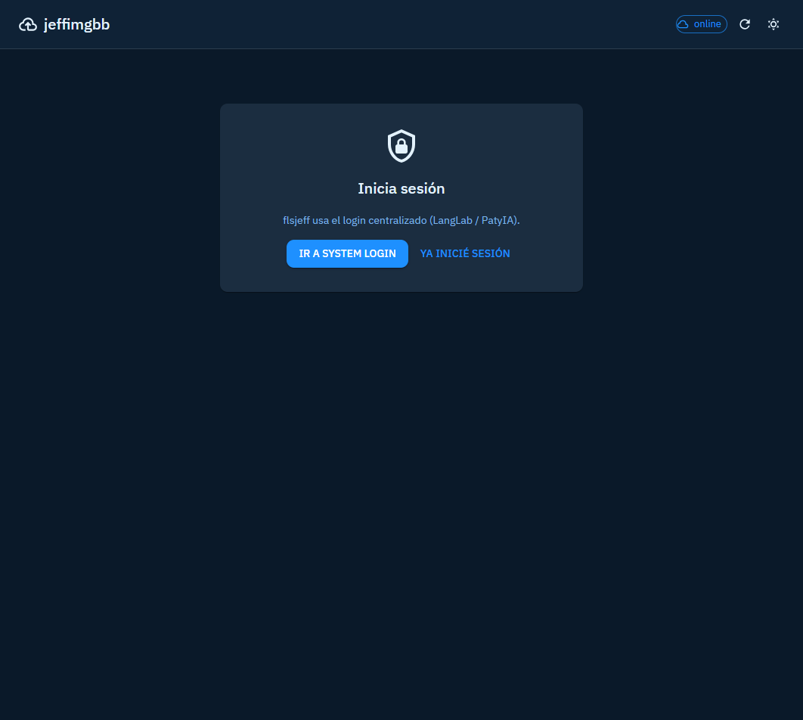

<p align="center">
  
</p>

<h1 align="center">flsjeff-front</h1>

<p align="center"><strong>Host de imágenes y archivos</strong> — subida a R2, galería con metadatos y URLs públicas para el ecosistema Jeff-Aporta.</p>

## Arquitectura


> **Fuente del diagrama:** [`docs/arquitectura.mmd`](docs/arquitectura.mmd) — editar el `.mmd`; regenerar imagen: `node scripts/mermaid-ink-url.mjs flsjeff/frontend/docs/arquitectura.mmd` (desde `apps/`).

[](https://jeff-aporta.github.io/flsjeff-front/)
[](https://react.dev/)
[](https://www.cloudflare.com/products/r2/)
[](https://github.com/Jeff-Aporta/flsjeff-back)

## Demo

**https://jeff-aporta.github.io/flsjeff-front/**

## Vista previa



## Qué hace

- **Drag & drop** o selector de archivos para subir a R2 vía Worker.
- **Galería** con vista previa de imágenes y metadatos técnicos.
- **Copiar URL** al portapapeles con un clic.
- **Tema** dark/light y toggle **local / producción** (TargetSwitch).
- Layout **sin scroll en body**: scroll solo en paneles internos.

## Metadatos

Icono: `mdi:cloud-upload-outline` · tema `#00838f` · [`JeffAppMeta`](https://github.com/Jeff-Aporta/front-shared/blob/main/cdn/isa/js/core/app-meta.js).

## Desarrollo local

```bash
npx serve .
# TargetSwitch → modo local + wrangler dev en flsjeff-back según necesidad
```

## Repos relacionados

| Repo | Rol |
|------|-----|
| [flsjeff-back](https://github.com/Jeff-Aporta/flsjeff-back) | API + R2 (Worker) |
| [flsjeff-front](https://github.com/Jeff-Aporta/flsjeff-front) | Este panel (GH Pages) |

MIT · [Jeff-Aporta](https://github.com/Jeff-Aporta)
